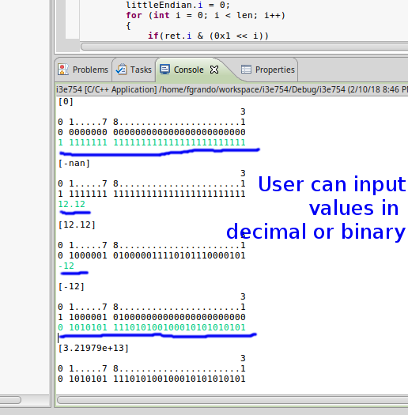

# ieee754
Example of IEEE754 Binary Floating-Point Arithmetic

This is just a sketch to help me studying the floating point encoding in PC. Still in development but already contain basic features such as convert binary to decimal float values and vice versa. 

# Thanks
This job was made easier by using an article of William Kahan available in  https://people.eecs.berkeley.edu/~wkahan/ieee754status/IEEE754.PDF.
